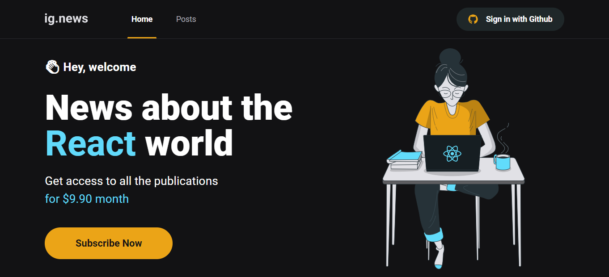

  

  
  
     

<h1 align="center">
    
</h1>

 

## 💻 Technologies

- [ Next.js](https://nextjs.org/)
- [ TypeScript](https://www.typescriptlang.org/)
- [ Sass](https://sass-lang.com/)
- [ FaunaDB](https://fauna.com/)
- [ Stripe](https://stripe.com/br)
- [ Prismic CMS](https://prismic.io/)
- [ Next Auth](https://next-auth.js.org/)
